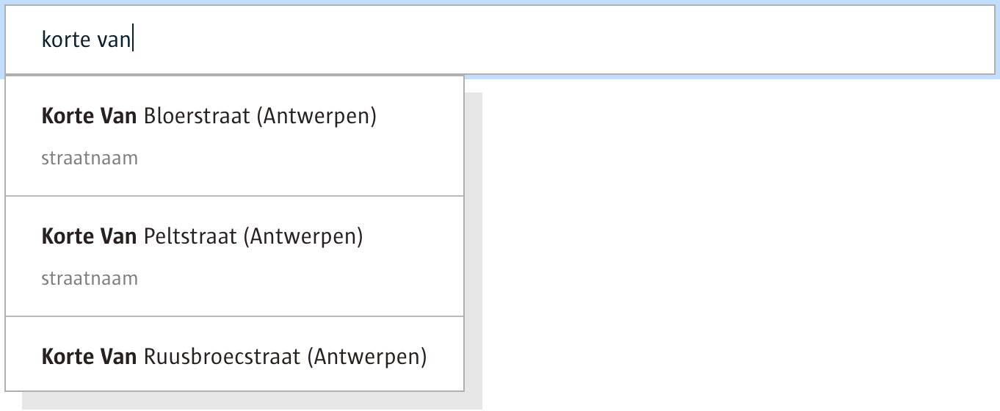

# Location picker Smart Widget UI (AngularJS)

With the location picker smart widget you can simply implement a location picker in any page.

You will also need the BFF package in order to get the location picker smart widget to work: [http://github.com/digipolisantwerp/location-picker_service_nodejs](http://github.com/digipolisantwerp/location-picker_service_nodejs)



There is a demo app, see below for instructions on running it.

## Changes

### v1.0.0

- original release

## How to use

### Installing

To install this package use bower

`bower install 'https://github.com/digipolisantwerp/location-picker_widget_ng1.git#^1.x.x'`.

Include `akit.component.locationPickerWidget` as module.

### In your template

```html
<aui-location-picker
    url="http://localhost:9999/api/locations"
    data-value="location">
</aui-location-picker>
```

(replace the url of the BFF service)

In your controller:

```js
function ($scope) {
	$scope.picker1;

	$scope.picker2 = {
		id: '87548',
		name: 'Piep-in-\'t-Riet',
		layer: 'straatnaam',
		street: 'Piep-in-\'t-Riet',
		locationType: 'street',
		coordinates: {
			latLng: {
				lat: 51.347332372152295,
				lng: 4.321095513044615
			},
			lambert: {
				x: 146677.56234668,
				y: 226398.39632439
			}
		}
	};
}
```

Every value in the backing list must have a unique id.

### Supported attributes

#### **url**

- **url**: the URL of the back-end service feeding this widget
- **value**: the current value of the picker, represented as a value object
- **placeholder**: specify the text to show in an empty field
- **noDataMessage**: the text shown in the list when there are no matching results
- **minLength**: the minimum number of characters typed before a search is triggered
- **bufferInputMs**: how long to buffer keystrokes before fetching remote results
- **types**: the type of values to search for; this is a comma-separated list of "street", "number" and/or "poi
- **searchingText**: the text shown while searching

### Events

- **valueChange**: triggers when the current value is changed (or cleared): `$scope.$on("valueChange", function(event, data) { ... });`

## Run the demo app

Run `npm install && bower install`.

Then run `gulp build && gulp serve`, then navigate to `./example/index.html' in the browser.

To interact with the location picker widget you will have to set up the corresponding BFF service,
as well as adjust necessary parameters in `example/index.html`.

### Developing

Please refer to the [contributing guide](CONTRIBUTING.md).
